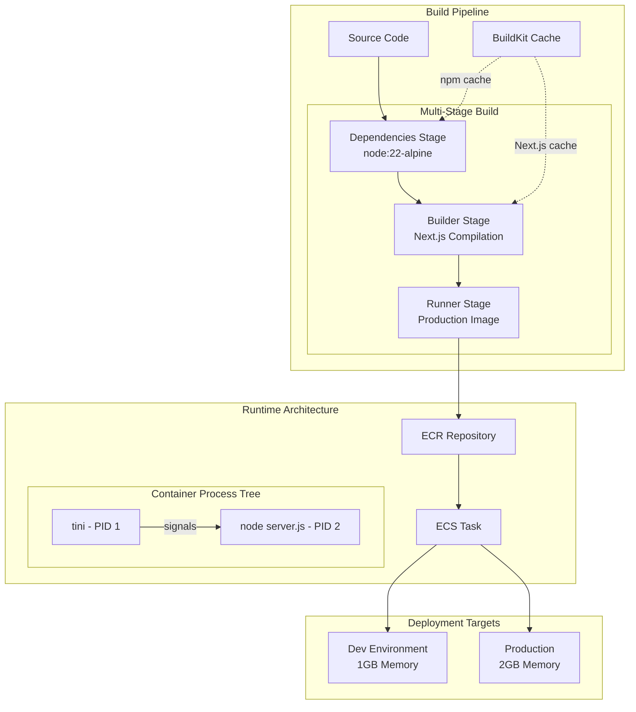
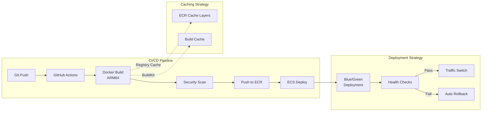
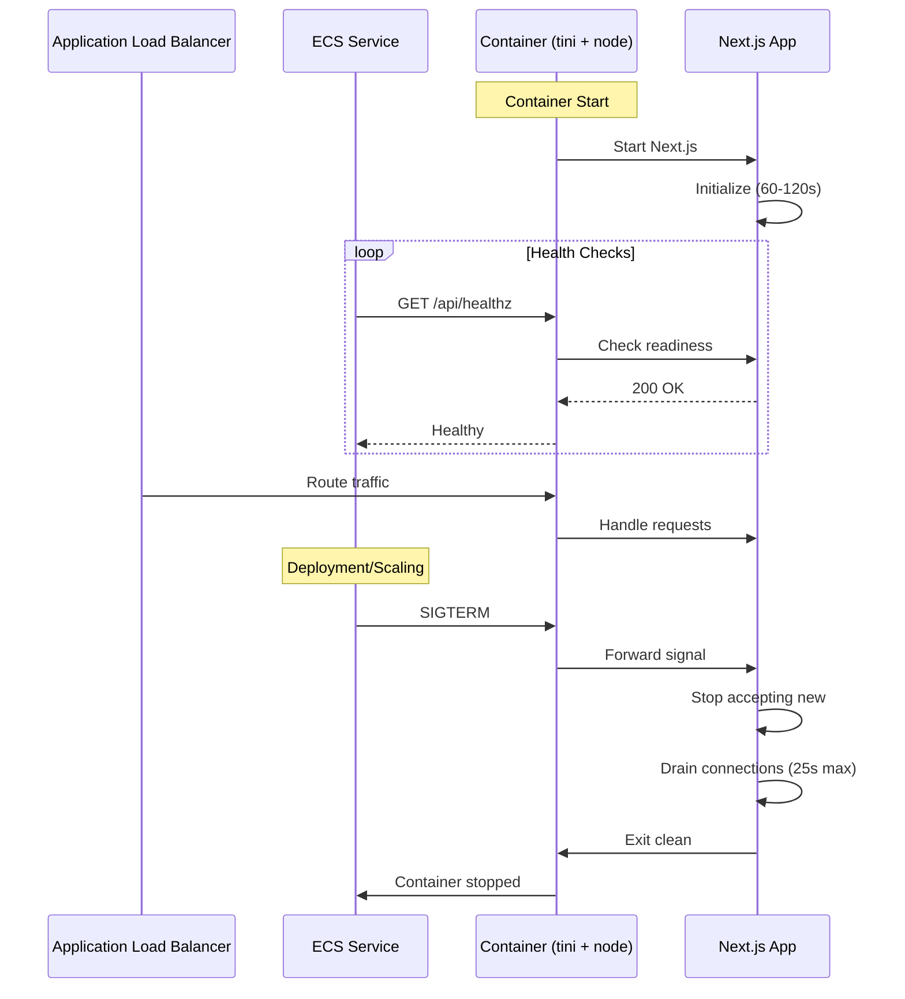
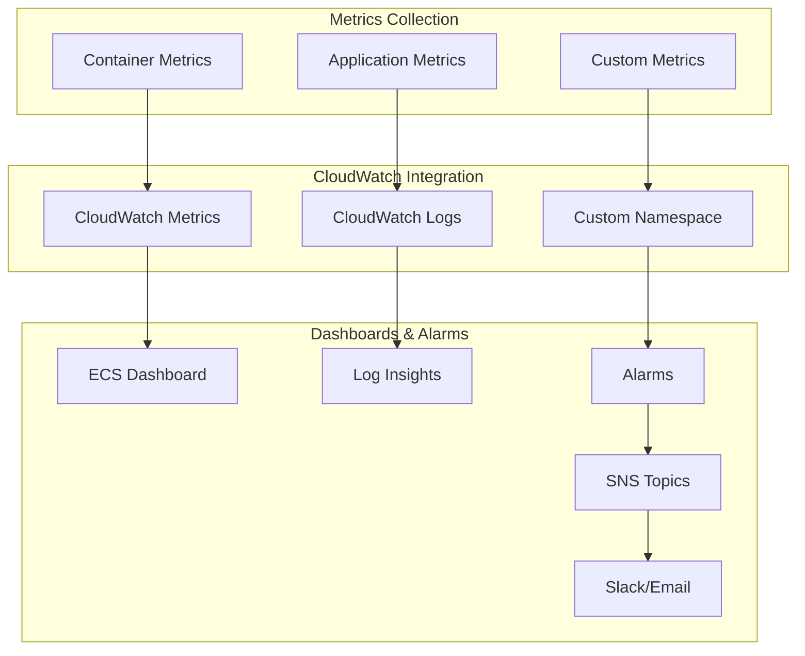
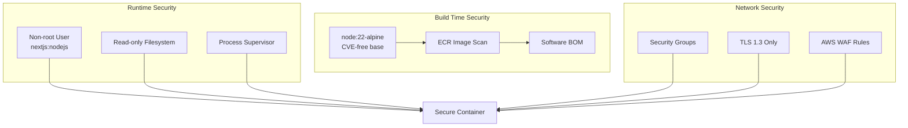

# ADR-003: Docker Container Optimization Architecture

## Status
Proposed

## Context

The AI Studio application is transitioning from AWS Amplify SSR to AWS ECS Fargate deployment (Epic #305). The current Docker implementation has critical gaps that could impact production reliability:

1. **PID 1 Signal Handling**: Node.js running as PID 1 ignores SIGTERM, causing ungraceful shutdowns
2. **Build Performance**: Container builds take 5-10 minutes without caching optimization
3. **Memory Management**: No memory limits configured, risking OOM kills
4. **Health Check Timing**: Insufficient startup period causes premature task failures
5. **Security Posture**: Using Node 20 with known vulnerabilities, writable filesystem

## Decision

Implement a multi-layered container optimization strategy focusing on reliability, performance, and security.

### Core Architectural Decisions:

1. **Graceful Shutdown Architecture**: Implement tini as PID 1 supervisor
2. **Build Cache Architecture**: Use BuildKit with persistent cache mounts
3. **Memory Management**: Explicit heap size configuration at 70% of container memory
4. **Health Check Strategy**: Dual-endpoint pattern (liveness vs readiness)
5. **Security Hardening**: Node 22 Alpine, read-only filesystem, non-root user

## Architecture Design

### Container Build Architecture



### Deployment Pipeline Architecture



### Container Lifecycle Management



## Implementation Components

### 1. Enhanced Dockerfile Structure

```dockerfile
# syntax=docker.io/docker/dockerfile:1

# Three-stage build with optimization layers
FROM node:22-alpine AS deps     # Dependencies with cache
FROM node:22-alpine AS builder   # Build with cache
FROM node:22-alpine AS runner    # Minimal production image
```

### 2. Process Supervision Architecture

```
Container Process Tree:
├── tini (PID 1) - Signal forwarding, zombie reaping
└── node (PID 2) - Application process
    └── Next.js workers
```

### 3. Memory Configuration Strategy

| Environment | Container Memory | Node Heap Size | Formula |
|------------|-----------------|----------------|---------|
| Development | 1024 MB | 700 MB | 70% of container |
| Production | 2048 MB | 1400 MB | 70% of container |

### 4. Health Check Architecture

```yaml
Endpoints:
  /api/healthz:  # Lightweight liveness check
    - Purpose: Container orchestration
    - Response: { status: "ok" }
    - Latency: <50ms

  /api/health:   # Comprehensive readiness check
    - Purpose: Detailed diagnostics
    - Checks: Database, Auth, S3
    - Latency: <500ms
```

## Monitoring & Observability Design



### Key Metrics

1. **Container Metrics**
   - CPU Utilization (alarm at 80%)
   - Memory Utilization (alarm at 85%)
   - Task count (min/max thresholds)

2. **Application Metrics**
   - Request latency (p50, p95, p99)
   - Error rate (5xx responses)
   - Streaming connection duration

3. **Build Metrics**
   - Build duration
   - Image size
   - Cache hit rate

## Security Architecture



## Consequences

### Positive Consequences

1. **Reliability**
   - Graceful shutdowns prevent dropped connections
   - Memory limits prevent OOM crashes
   - Health checks ensure only ready containers receive traffic

2. **Performance**
   - 50-90% faster builds with caching
   - 33% smaller images (120MB vs 180MB)
   - Faster container startup (30-45s vs 60-90s)

3. **Security**
   - Latest Node 22 with no known CVEs
   - Defense in depth with multiple security layers
   - Automated vulnerability scanning

4. **Developer Experience**
   - Faster feedback loops
   - Consistent behavior across environments
   - Clear monitoring and debugging

### Negative Consequences

1. **Complexity**
   - More configuration to maintain
   - Requires BuildKit support in CI/CD
   - Additional monitoring setup

2. **Migration Effort**
   - Testing required for all changes
   - Team training on new patterns
   - Documentation updates needed

## Alternatives Considered

### Alternative 1: Distroless Images
- **Pros**: Minimal attack surface, smaller size
- **Cons**: Harder debugging, no shell access
- **Decision**: Alpine provides good balance

### Alternative 2: PM2 Process Manager
- **Pros**: Built-in clustering, monitoring
- **Cons**: Additional complexity, memory overhead
- **Decision**: Tini is simpler and sufficient

### Alternative 3: Kubernetes Instead of ECS
- **Pros**: More portable, richer ecosystem
- **Cons**: Higher complexity, team expertise
- **Decision**: ECS aligns with existing AWS expertise

## Migration Plan

### Phase 1: Critical Fixes (Week 1)
- [ ] Upgrade to Node 22 Alpine
- [ ] Add tini for signal handling
- [ ] Configure memory limits
- [ ] Extend health check periods

### Phase 2: Performance (Week 2)
- [ ] Implement BuildKit caching
- [ ] Create /api/healthz endpoint
- [ ] Optimize .dockerignore
- [ ] Add graceful shutdown handler

### Phase 3: Security & Monitoring (Week 3)
- [ ] Enable read-only filesystem
- [ ] Set up image scanning
- [ ] Configure CloudWatch dashboards
- [ ] Implement custom metrics

## Success Metrics

1. **Build Performance**
   - Target: <3 minute builds
   - Measurement: GitHub Actions duration

2. **Container Reliability**
   - Target: Zero ungraceful shutdowns
   - Measurement: ECS deployment metrics

3. **Resource Efficiency**
   - Target: <150MB image size
   - Measurement: ECR repository stats

4. **Deployment Success**
   - Target: 100% successful deployments
   - Measurement: ECS deployment history

## References

- [Next.js Docker Deployment Guide](https://nextjs.org/docs/deployment#docker-image)
- [AWS ECS Best Practices](https://docs.aws.amazon.com/AmazonECS/latest/bestpracticesguide/)
- [Docker Node Best Practices](https://github.com/nodejs/docker-node/blob/main/docs/BestPractices.md)
- [BuildKit Documentation](https://docs.docker.com/build/buildkit/)
- Issue #307: Docker Container Optimization
- Epic #305: ECS Fargate Migration

## Decision

We will implement the comprehensive container optimization architecture as described, prioritizing graceful shutdown handling and build performance optimizations as the most critical improvements for production readiness.

**Approved by**: Architecture Team
**Date**: 2025-01-10
**Review Date**: 2025-04-10