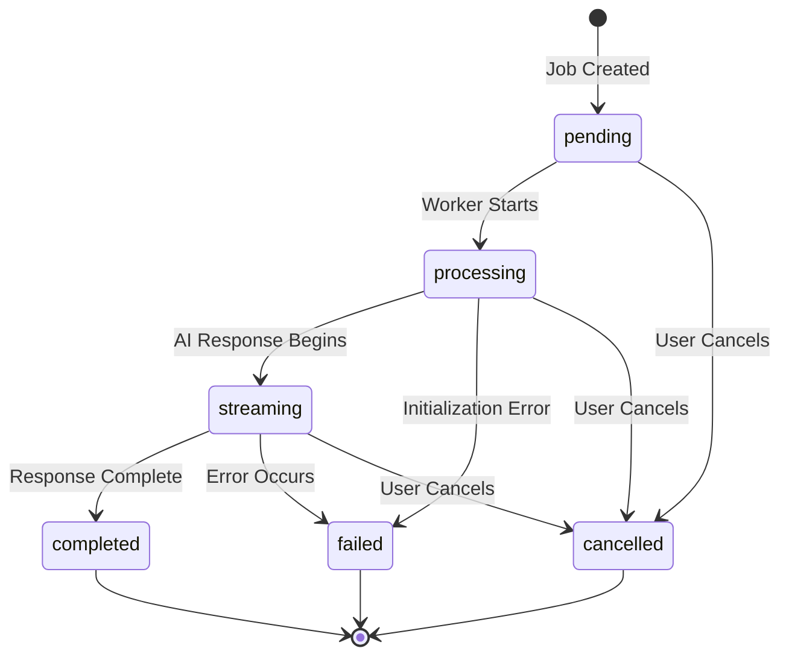

# Polling API Integration Guide

## Overview

The Polling API provides a standardized interface for client applications to interact with the Universal Polling Architecture. This system enables real-time progress tracking and result retrieval for long-running AI operations that exceed AWS Amplify's 30-second timeout limit.

## API Endpoints

### Job Creation Endpoint

**POST** `/api/nexus/chat`

Creates a new AI streaming job and returns polling instructions.

#### Request Format
```typescript
interface ChatRequest {
  messages: UIMessage[];           // Chat history with assistant-ui format
  modelId: string;                // AI model identifier (e.g., "gpt-4o")
  provider?: string;              // Provider name (default: "openai")
  conversationId?: string;        // Existing conversation UUID (optional)
  enabledTools?: string[];        // Tool names to enable
  reasoningEffort?: 'minimal' | 'low' | 'medium' | 'high';
  responseMode?: 'standard' | 'priority' | 'flex';
}
```

#### Response Format
```typescript
interface JobCreationResponse {
  jobId: string;                  // UUID for polling
  conversationId: string;         // Conversation UUID
  status: 'pending';              // Initial job status
  message: string;                // Success message
  requestId: string;              // Request tracking ID
  title?: string;                 // Generated conversation title (new conversations)
}
```

#### Example
```typescript
// Create streaming job
const response = await fetch('/api/nexus/chat', {
  method: 'POST',
  headers: { 'Content-Type': 'application/json' },
  body: JSON.stringify({
    messages: [
      { role: 'user', content: 'Explain quantum computing' }
    ],
    modelId: 'gpt-4o',
    provider: 'openai',
    enabledTools: ['search', 'calculator']
  })
});

const job = await response.json();
// Returns: { jobId: "uuid-123", conversationId: "uuid-456", status: "pending" }
```

### Job Polling Endpoint

**GET** `/api/nexus/chat/jobs/[jobId]`

Retrieves current job status and progressive updates.

#### Response Format
```typescript
interface JobStatusResponse {
  jobId: string;                    // Job identifier
  conversationId: string;           // Associated conversation
  nexusConversationId?: string;     // Nexus-specific conversation ID
  status: UniversalPollingStatus;   // Current job status
  createdAt: string;               // ISO timestamp
  startedAt?: string;              // Processing start time
  completedAt?: string;            // Completion time
  expiresAt?: string;              // Job expiration time
  
  // Progressive content
  partialContent: string;          // Current AI response content
  progressInfo?: ProgressInfo;     // Processing metadata
  
  // Final results (completed jobs only)
  responseData?: {
    text: string;
    usage: {
      promptTokens: number;
      completionTokens: number;
      totalTokens: number;
      reasoningTokens?: number;
      totalCost?: number;
    };
    finishReason: string;
  };
  
  // Error information (failed jobs only)
  errorMessage?: string;
  
  // Polling guidance
  pollingInterval: number;         // Recommended polling interval (ms)
  shouldContinuePolling: boolean;  // Whether to continue polling
  requestId: string;               // Request tracking ID
}
```

#### Status Values
- `pending`: Job queued for processing
- `processing`: Job initializing
- `streaming`: Actively generating content
- `completed`: Job finished successfully
- `failed`: Job failed due to error
- `cancelled`: Job cancelled by user

#### Example
```typescript
// Poll job status
const pollJob = async (jobId: string): Promise<JobStatusResponse> => {
  const response = await fetch(`/api/nexus/chat/jobs/${jobId}`);
  return response.json();
};

const status = await pollJob('uuid-123');
console.log(status.partialContent); // Current AI response
```

### Job Cancellation Endpoint

**DELETE** `/api/nexus/chat/jobs/[jobId]`

Cancels a running job.

#### Response Format
```typescript
interface JobCancellationResponse {
  success: boolean;
  jobId: string;
  status: 'cancelled';
  message: string;
  requestId: string;
}
```

#### Example
```typescript
// Cancel job
const cancelJob = async (jobId: string) => {
  const response = await fetch(`/api/nexus/chat/jobs/${jobId}`, {
    method: 'DELETE'
  });
  return response.json();
};

await cancelJob('uuid-123');
// Returns: { success: true, status: 'cancelled' }
```

## Client-Side Integration Patterns

### React Hook Integration

```typescript
import { usePolling } from '@/hooks/usePolling';

interface UseStreamingJobOptions {
  jobId: string;
  enabled?: boolean;
  onUpdate?: (response: JobStatusResponse) => void;
  onComplete?: (response: JobStatusResponse) => void;
  onError?: (error: Error) => void;
}

export function useStreamingJob({ 
  jobId, 
  enabled = true,
  onUpdate,
  onComplete,
  onError 
}: UseStreamingJobOptions) {
  const { data: jobStatus, error, isLoading } = usePolling(
    `/api/nexus/chat/jobs/${jobId}`,
    {
      enabled: enabled && !!jobId,
      refetchInterval: (data) => {
        if (!data?.shouldContinuePolling) return false;
        return data.pollingInterval || 1000;
      },
      onSuccess: (data) => {
        onUpdate?.(data);
        
        if (data.status === 'completed') {
          onComplete?.(data);
        }
      },
      onError
    }
  );
  
  const cancelJob = async () => {
    await fetch(`/api/nexus/chat/jobs/${jobId}`, { method: 'DELETE' });
  };
  
  return {
    jobStatus,
    isLoading,
    error,
    cancelJob,
    isCompleted: jobStatus?.status === 'completed',
    isFailed: jobStatus?.status === 'failed',
    canCancel: ['pending', 'processing', 'streaming'].includes(jobStatus?.status || '')
  };
}
```

### Complete Chat Component

```typescript
import React, { useState } from 'react';
import { useStreamingJob } from './useStreamingJob';

export function StreamingChat() {
  const [jobId, setJobId] = useState<string | null>(null);
  const [messages, setMessages] = useState<Message[]>([]);
  const [input, setInput] = useState('');
  
  const { jobStatus, cancelJob, isCompleted, canCancel } = useStreamingJob({
    jobId: jobId || '',
    enabled: !!jobId,
    onUpdate: (response) => {
      // Update messages with partial content
      if (response.partialContent) {
        setMessages(prev => {
          const newMessages = [...prev];
          const lastMessage = newMessages[newMessages.length - 1];
          
          if (lastMessage?.role === 'assistant') {
            lastMessage.content = response.partialContent;
          } else {
            newMessages.push({
              role: 'assistant',
              content: response.partialContent
            });
          }
          
          return newMessages;
        });
      }
    },
    onComplete: (response) => {
      console.log('Job completed:', response.responseData);
      setJobId(null); // Stop polling
    }
  });
  
  const sendMessage = async () => {
    if (!input.trim()) return;
    
    // Add user message
    const newMessages = [...messages, { role: 'user', content: input }];
    setMessages(newMessages);
    setInput('');
    
    // Create streaming job
    const response = await fetch('/api/nexus/chat', {
      method: 'POST',
      headers: { 'Content-Type': 'application/json' },
      body: JSON.stringify({
        messages: newMessages,
        modelId: 'gpt-4o',
        provider: 'openai'
      })
    });
    
    const job = await response.json();
    setJobId(job.jobId);
  };
  
  return (
    <div className="chat-container">
      {/* Message list */}
      <div className="messages">
        {messages.map((message, index) => (
          <div key={index} className={`message ${message.role}`}>
            {message.content}
          </div>
        ))}
      </div>
      
      {/* Status indicator */}
      {jobStatus && (
        <div className="status-bar">
          <span>Status: {jobStatus.status}</span>
          {canCancel && (
            <button onClick={cancelJob}>Cancel</button>
          )}
        </div>
      )}
      
      {/* Input */}
      <div className="input-area">
        <input
          value={input}
          onChange={(e) => setInput(e.target.value)}
          placeholder="Type your message..."
          disabled={!!jobId}
        />
        <button onClick={sendMessage} disabled={!!jobId}>
          Send
        </button>
      </div>
    </div>
  );
}
```

## Job Lifecycle Management

### State Transitions



### Job Expiration

Jobs automatically expire to prevent database bloat:

```typescript
// Default expiration times
const EXPIRATION_TIMES = {
  pending: 1 * 60 * 60 * 1000,    // 1 hour
  processing: 2 * 60 * 60 * 1000, // 2 hours  
  streaming: 2 * 60 * 60 * 1000,  // 2 hours
  completed: 24 * 60 * 60 * 1000, // 24 hours
  failed: 24 * 60 * 60 * 1000,    // 24 hours
  cancelled: 1 * 60 * 60 * 1000   // 1 hour
};
```

### Cleanup Process

Automated cleanup removes expired jobs:

```sql
-- Cleanup function (runs via cron/scheduler)
SELECT cleanup_expired_streaming_jobs();

-- Returns count of deleted jobs
-- Removes jobs where expires_at < NOW()
```

## Error Handling and Recovery

### Error Categories

1. **Validation Errors** (400)
   - Invalid request format
   - Missing required parameters
   - Malformed message content

2. **Authentication Errors** (401)
   - No session token
   - Invalid session token
   - Expired session

3. **Authorization Errors** (403)
   - Job owned by different user
   - Insufficient permissions

4. **Not Found Errors** (404)
   - Job ID not found
   - Conversation not found

5. **System Errors** (500)
   - Database connectivity issues
   - SQS queue errors
   - Provider API failures

### Error Response Format

```typescript
interface ErrorResponse {
  error: string;                // Error message
  details?: any;               // Additional error details
  requestId: string;           // Request tracking ID
  jobId?: string;              // Job ID (if applicable)
}
```

### Retry Strategies

#### Client-Side Retries
```typescript
const retryPolling = async (jobId: string, maxRetries = 3) => {
  for (let attempt = 1; attempt <= maxRetries; attempt++) {
    try {
      const response = await fetch(`/api/nexus/chat/jobs/${jobId}`);
      
      if (response.ok) {
        return response.json();
      }
      
      // Exponential backoff
      const delay = Math.pow(2, attempt) * 1000;
      await new Promise(resolve => setTimeout(resolve, delay));
      
    } catch (error) {
      if (attempt === maxRetries) throw error;
    }
  }
};
```

#### Server-Side Retries
```typescript
// SQS Dead Letter Queue handling
const handleFailedJob = async (jobId: string, error: Error) => {
  await jobManagementService.failJob(jobId, error.message);
  
  // Send to DLQ for manual review if needed
  if (isRetryableError(error)) {
    await requeueJob(jobId, { delay: 60000 }); // Retry after 1 minute
  }
};
```

## Performance Optimization

### Adaptive Polling Intervals

The system adjusts polling frequency based on model characteristics:

```typescript
const getOptimalPollingInterval = (modelId: string, status: string): number => {
  const baseInterval = 1000; // 1 second
  
  // Reasoning models need slower polling
  if (modelId.includes('o1') || modelId.includes('o3')) {
    return baseInterval * 2;
  }
  
  // Adjust by status
  switch (status) {
    case 'pending': return baseInterval;
    case 'processing': return baseInterval * 2;
    case 'streaming': return baseInterval;
    case 'completed':
    case 'failed': return baseInterval * 5; // Slower for terminal states
    default: return baseInterval;
  }
};
```

### Caching Strategy

HTTP response caching based on job status:

```typescript
// Response headers by job status
const getCacheHeaders = (status: string): Record<string, string> => {
  if (['completed', 'failed', 'cancelled'].includes(status)) {
    return {
      'Cache-Control': 'private, max-age=60', // Cache terminal states briefly
      'ETag': `"job-${jobId}-${status}"`
    };
  }
  
  return {
    'Cache-Control': 'private, no-cache, no-store, must-revalidate' // No cache for active jobs
  };
};
```

### Request Deduplication

Prevent duplicate polling requests:

```typescript
const requestCache = new Map<string, Promise<JobStatusResponse>>();

const pollWithDeduplication = async (jobId: string): Promise<JobStatusResponse> => {
  const cacheKey = `poll-${jobId}`;
  
  if (requestCache.has(cacheKey)) {
    return requestCache.get(cacheKey)!;
  }
  
  const request = fetch(`/api/nexus/chat/jobs/${jobId}`)
    .then(res => res.json())
    .finally(() => {
      // Clear cache after request completes
      setTimeout(() => requestCache.delete(cacheKey), 100);
    });
  
  requestCache.set(cacheKey, request);
  return request;
};
```

## Integration Testing

### End-to-End Test Flow

```typescript
describe('Polling API Integration', () => {
  it('should handle complete job lifecycle', async () => {
    // 1. Create job
    const createResponse = await request(app)
      .post('/api/nexus/chat')
      .send({
        messages: [{ role: 'user', content: 'Test message' }],
        modelId: 'gpt-4o',
        provider: 'openai'
      })
      .expect(202);
    
    const { jobId } = createResponse.body;
    
    // 2. Poll until completion
    let status;
    let attempts = 0;
    const maxAttempts = 30;
    
    do {
      await new Promise(resolve => setTimeout(resolve, 1000));
      
      const pollResponse = await request(app)
        .get(`/api/nexus/chat/jobs/${jobId}`)
        .expect(200);
      
      status = pollResponse.body;
      attempts++;
      
    } while (status.shouldContinuePolling && attempts < maxAttempts);
    
    // 3. Verify completion
    expect(status.status).toBe('completed');
    expect(status.responseData).toBeDefined();
    expect(status.responseData.text).toBeTruthy();
  });
  
  it('should handle job cancellation', async () => {
    const createResponse = await request(app)
      .post('/api/nexus/chat')
      .send({
        messages: [{ role: 'user', content: 'Long task' }],
        modelId: 'gpt-4o'
      });
    
    const { jobId } = createResponse.body;
    
    // Cancel job
    await request(app)
      .delete(`/api/nexus/chat/jobs/${jobId}`)
      .expect(200);
    
    // Verify cancellation
    const pollResponse = await request(app)
      .get(`/api/nexus/chat/jobs/${jobId}`)
      .expect(200);
    
    expect(pollResponse.body.status).toBe('cancelled');
  });
});
```

## Monitoring and Analytics

### Key Metrics

Track these metrics for system health:

1. **Job Creation Rate**: Jobs created per minute
2. **Processing Latency**: Time from creation to completion
3. **Success Rate**: Percentage of jobs completing successfully
4. **Polling Efficiency**: Average polls per job completion
5. **Queue Depth**: Pending jobs in SQS queue
6. **Error Rates**: Failures by category and provider

### Logging Strategy

```typescript
// Structured logging for observability
const log = createLogger({ 
  requestId, 
  jobId, 
  userId,
  route: 'api.nexus.chat.jobs.poll' 
});

log.info('Job status polled', {
  status: job.status,
  hasPartialContent: !!job.partialContent,
  contentLength: job.partialContent?.length || 0,
  pollingInterval,
  shouldContinuePolling
});
```

This comprehensive API enables robust client integration with the Universal Polling Architecture, providing excellent user experience for long-running AI operations.