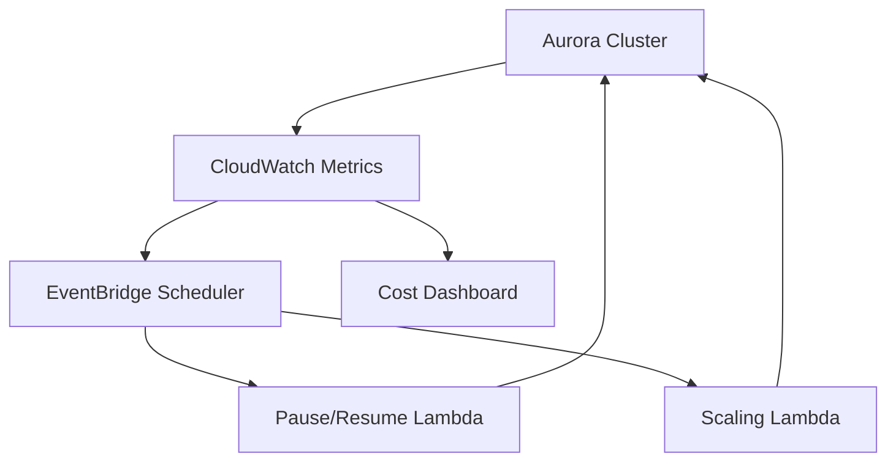

# Aurora Serverless v2 Cost Optimization Guide

## Overview

This implementation adds intelligent cost optimization to existing Aurora Serverless v2 databases **without disrupting or recreating them**. The solution provides automated scaling and pause/resume functionality that can reduce costs by 30-95% depending on the environment.

## 🎯 Cost Reduction Targets

| Environment | Current Cost | Target Cost | Monthly Savings | Strategy |
|------------|--------------|-------------|-----------------|----------|
| **Dev** | $44/month | $2/month | **$42 (95%)** | Auto-pause during idle periods |
| **Staging** | $44/month | $24/month | **$20 (45%)** | Auto-pause + scheduled scaling |
| **Prod** | $176/month | $123/month | **$53 (30%)** | Predictive scheduled scaling |
| **TOTAL** | **$264/month** | **$149/month** | **$115/month (44%)** | Combined strategies |

## 🏗️ Architecture

### Components

1. **AuroraCostOptimizer** - CDK construct that adds optimization to existing clusters
2. **Pause/Resume Lambda** - Python function that monitors and pauses idle databases
3. **Predictive Scaling Lambda** - Python function that scales based on schedules
4. **Cost Dashboard** - CloudWatch dashboard for monitoring and cost tracking

### How It Works



## 🚀 Quick Start

### Prerequisites

- Existing Aurora Serverless v2 cluster
- AWS CDK v2 installed
- Node.js 20.x
- Python 3.12 (for Lambda functions)

### Step 1: Add Optimization to Existing Stack

```typescript
import { AuroraCostOptimizer, AuroraCostDashboard } from "./constructs"
import * as rds from "aws-cdk-lib/aws-rds"

// In your existing DatabaseStack
export class DatabaseStack extends cdk.Stack {
  constructor(scope: Construct, id: string, props: DatabaseStackProps) {
    super(scope, id, props)

    // Your existing cluster
    const cluster = new rds.DatabaseCluster(this, "Cluster", {
      // ... existing configuration ...
    })

    // Add cost optimization (NON-DESTRUCTIVE)
    new AuroraCostOptimizer(this, "CostOptimizer", {
      cluster,
      environment: props.environment,
    })

    // Add cost monitoring dashboard
    new AuroraCostDashboard(this, "CostDashboard", {
      cluster,
      environment: props.environment,
    })
  }
}
```

### Step 2: Deploy

```bash
cd infra

# Deploy to dev first (safest)
npx cdk deploy AIStudio-DatabaseStack-Dev

# Verify auto-pause is working (check Lambda logs after 30 min idle)
aws logs tail /aws/lambda/pause-resume-dev --follow

# Deploy to other environments
npx cdk deploy AIStudio-DatabaseStack-Staging
npx cdk deploy AIStudio-DatabaseStack-Prod
```

### Step 3: Monitor

View the cost dashboard:
```bash
# Get dashboard URL from stack outputs
aws cloudformation describe-stacks \
  --stack-name AIStudio-DatabaseStack-Dev \
  --query 'Stacks[0].Outputs[?OutputKey==`DashboardUrl`].OutputValue' \
  --output text
```

## 📊 Configuration Examples

### Development Environment

Aggressive cost savings with auto-pause:

```typescript
new AuroraCostOptimizer(this, "DevOptimizer", {
  cluster,
  environment: "dev",
  enableAutoPause: true,
  idleMinutesBeforePause: 30, // Pause after 30 minutes idle
  enableScheduledScaling: false, // Not needed in dev
})
```

**Expected Behavior:**
- Database pauses after 30 minutes with no connections
- Automatically wakes up on next connection attempt (~30 second delay)
- Runs at minimum 0.5 ACU when active
- **Savings: ~$42/month (95%)**

### Staging Environment

Balanced approach with auto-pause and business hours scaling:

```typescript
new AuroraCostOptimizer(this, "StagingOptimizer", {
  cluster,
  environment: "staging",
  enableAutoPause: true,
  idleMinutesBeforePause: 30,
  enableScheduledScaling: true,
  businessHours: {
    scaleUpHour: 8, // 8 AM
    scaleDownHour: 18, // 6 PM
    daysOfWeek: "MON-FRI",
  },
  scaling: {
    businessHoursMin: 0.5,
    businessHoursMax: 2.0,
    offHoursMin: 0.5,
    offHoursMax: 1.0,
  },
})
```

**Expected Behavior:**
- Scales up to 0.5-2 ACU during business hours (M-F 8am-6pm)
- Scales down to 0.5-1 ACU after hours
- Pauses during extended idle periods
- **Savings: ~$20/month (45%)**

### Production Environment

Predictive scaling without auto-pause (reliability first):

```typescript
new AuroraCostOptimizer(this, "ProdOptimizer", {
  cluster,
  environment: "prod",
  enableAutoPause: false, // Never pause production!
  enableScheduledScaling: true,
  businessHours: {
    scaleUpHour: 7, // Pre-warm at 7 AM
    scaleDownHour: 20, // Scale down at 8 PM
    daysOfWeek: "MON-FRI",
  },
  scaling: {
    businessHoursMin: 2.0,
    businessHoursMax: 8.0,
    offHoursMin: 1.0,
    offHoursMax: 4.0,
  },
})
```

**Expected Behavior:**
- Scales to 2-8 ACU during business hours (M-F 7:30am-8pm)
- Scales to 1-4 ACU after hours and weekends
- Never pauses (always available)
- **Savings: ~$53/month (30%)**

## 🔧 Customization

### Custom Idle Timeout

```typescript
new AuroraCostOptimizer(this, "Optimizer", {
  cluster,
  environment: "dev",
  idleMinutesBeforePause: 60, // Wait 60 minutes instead of 30
})
```

### Custom Business Hours

```typescript
new AuroraCostOptimizer(this, "Optimizer", {
  cluster,
  environment: "staging",
  businessHours: {
    scaleUpHour: 6, // Start earlier
    scaleDownHour: 22, // End later
    daysOfWeek: "MON-SAT", // Include Saturday
  },
})
```

### Manual Override

To manually resume a paused database:

```bash
aws lambda invoke \
  --function-name pause-resume-dev \
  --payload '{"action": "resume", "reason": "Manual override"}' \
  response.json
```

To manually trigger scaling:

```bash
aws lambda invoke \
  --function-name predictive-scaling-prod \
  --payload '{"minCapacity": 4.0, "maxCapacity": 8.0, "reason": "High traffic expected"}' \
  response.json
```

## 📈 Monitoring

### CloudWatch Dashboard

Each environment gets a comprehensive dashboard showing:

- **Current ACU usage** - Real-time capacity
- **Estimated hourly cost** - Based on current ACU × $0.12
- **Projected monthly cost** - Extrapolated from current usage
- **Database connections** - Activity monitoring
- **CPU utilization** - Performance metrics
- **Optimization status** - Which strategies are active

### CloudWatch Alarms

Automatically created alarms:

- **Pause/Resume Errors** - Alerts if auto-pause fails
- **High Error Rate** - Alerts if Lambda functions fail repeatedly

### Lambda Logs

Monitor optimization actions:

```bash
# Dev auto-pause logs
aws logs tail /aws/lambda/pause-resume-dev --follow

# Prod scaling logs
aws logs tail /aws/lambda/predictive-scaling-prod --follow
```

## 🔒 Safety Features

### Non-Destructive Design

- **No database recreation** - Works with existing clusters
- **No data migration** - Database contents untouched
- **Gradual scaling** - Aurora scales smoothly over 1-3 minutes
- **Automatic rollback** - Failures don't leave cluster in bad state

### Production Safeguards

- **Auto-pause disabled by default** in production
- **Connection checks** before pausing (never pause active databases)
- **Error alarms** for failed operations
- **CloudWatch logging** for all actions

### Wake-Up Handling

When a paused database receives a connection:

1. Connection attempt triggers Aurora auto-resume
2. ~30 second cold start (one-time)
3. Subsequent connections are instant
4. No application changes needed

## 🧪 Testing

### Run Unit Tests

```bash
cd infra
npm test -- aurora-cost-optimizer.test.ts
npm test -- aurora-cost-dashboard.test.ts
```

### Manual Testing

1. **Test Auto-Pause** (Dev):
   ```bash
   # Stop all app connections
   # Wait 30 minutes
   # Check CloudWatch logs for pause action
   # Try connecting - should auto-resume
   ```

2. **Test Scheduled Scaling** (Staging/Prod):
   ```bash
   # Invoke Lambda manually to test scaling
   aws lambda invoke \
     --function-name predictive-scaling-staging \
     --payload '{"minCapacity": 1.0, "maxCapacity": 2.0}' \
     response.json

   # Verify cluster scaled
   aws rds describe-db-clusters \
     --db-cluster-identifier <cluster-id> \
     --query 'DBClusters[0].ServerlessV2ScalingConfiguration'
   ```

3. **Test Cost Dashboard**:
   - Open dashboard URL from CloudFormation outputs
   - Verify all widgets display data
   - Check cost calculations are accurate

## 📊 Success Metrics

### Week 1: Validation

- [ ] All Lambda functions executing without errors
- [ ] Auto-pause working in dev (check logs)
- [ ] Scheduled scaling occurring at correct times
- [ ] Dashboard showing accurate metrics

### Week 2: Cost Verification

- [ ] Review AWS Cost Explorer for actual savings
- [ ] Compare projected vs. actual costs
- [ ] Adjust schedules if needed based on usage patterns

### Month 1: Optimization

- [ ] Achieve target cost reductions
- [ ] Zero production incidents related to optimization
- [ ] Team comfortable with monitoring and override procedures

## 🚨 Troubleshooting

### Database Won't Pause

**Symptoms:** Auto-pause schedule runs but database stays active

**Causes:**
- Active connections still present
- Recent activity within idle threshold
- Manual resume was triggered

**Solution:**
```bash
# Check current connections
aws rds describe-db-clusters \
  --db-cluster-identifier <id> \
  --query 'DBClusters[0].ServerlessV2ScalingConfiguration'

# Check Lambda logs for details
aws logs tail /aws/lambda/pause-resume-dev --since 1h
```

### Slow Wake-Up Times

**Symptoms:** 30+ second delay when connecting to paused database

**Expected:** This is normal Aurora Serverless v2 behavior for cold starts

**Mitigation:**
- Increase idle timeout to pause less frequently
- Use connection warming (scheduled Lambda to query database)
- Consider disabling auto-pause if not acceptable

### Scaling Not Occurring

**Symptoms:** Scheduled scaling events don't change cluster capacity

**Causes:**
- EventBridge rules disabled
- Lambda function errors
- Insufficient IAM permissions

**Solution:**
```bash
# Check EventBridge rules are enabled
aws events list-rules --name-prefix aurora

# Check Lambda execution logs
aws logs tail /aws/lambda/predictive-scaling-prod --since 1h

# Test Lambda manually
aws lambda invoke \
  --function-name predictive-scaling-prod \
  --payload '{"action": "test"}' \
  response.json
```

### Higher Than Expected Costs

**Symptoms:** Cost savings not meeting targets

**Causes:**
- Database not actually idle (constant connections)
- Scaling schedules don't match usage patterns
- Higher baseline usage than expected

**Solution:**
1. Review dashboard for actual usage patterns
2. Check DatabaseConnections metric for idle periods
3. Adjust idle timeout or scaling schedules
4. Consider application-level optimizations

## 🔄 Rollback Procedure

If you need to disable optimization:

```typescript
// Comment out or remove optimizer
// new AuroraCostOptimizer(this, "Optimizer", { ... })

// Deploy
npx cdk deploy AIStudio-DatabaseStack-Dev
```

This removes automation but **does not affect** your database or its data.

## 📚 Additional Resources

- [Aurora Serverless v2 Documentation](https://docs.aws.amazon.com/AmazonRDS/latest/AuroraUserGuide/aurora-serverless-v2.html)
- [RDS Data API](https://docs.aws.amazon.com/AmazonRDS/latest/AuroraUserGuide/data-api.html)
- [CloudWatch Metrics for RDS](https://docs.aws.amazon.com/AmazonRDS/latest/AuroraUserGuide/monitoring-cloudwatch.html)
- [Epic #372: CDK Infrastructure Optimization](https://github.com/your-org/aistudio/issues/372)

## 🤝 Support

- **Issue Tracker**: GitHub Issues
- **Slack**: #infrastructure channel
- **Email**: infrastructure@example.com

---

**Last Updated**: 2025-10-23
**Version**: 1.0.0
**Related Issues**: #372 (Epic), #373 (Base Constructs), #374 (This Implementation)
