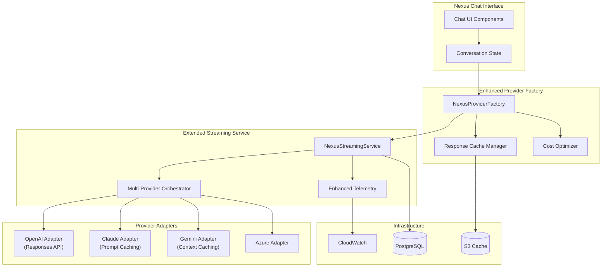

# Issue #153: Integration: Unified Provider Factory Updates for Nexus

## Architecture Design

### 1. Overview

Extend the existing UnifiedStreamingService and provider factory to support Nexus-specific features including multi-provider conversations, response caching, and enhanced telemetry. This design maintains backward compatibility while adding new capabilities.

### 2. System Architecture



### 3. Component Design

#### 3.1 NexusProviderFactory (Extends existing factory)

```typescript
// /lib/streaming/nexus/nexus-provider-factory.ts
import { createProviderModel } from '@/app/api/chat/lib/provider-factory';

export class NexusProviderFactory {
  private responseCache: ResponseCacheManager;
  private costOptimizer: CostOptimizer;
  private metricsCollector: MetricsCollector;
  
  async createNexusModel(
    provider: string,
    modelId: string,
    options: NexusModelOptions
  ): Promise<NexusLanguageModel> {
    // Use existing factory for base model
    const baseModel = await createProviderModel(provider, modelId);
    
    // Wrap with Nexus enhancements
    return new NexusModelWrapper({
      baseModel,
      caching: this.configureCaching(provider, options),
      optimization: this.configureOptimization(provider, options),
      telemetry: this.configureTelemetry(provider, options)
    });
  }
  
  private configureCaching(provider: string, options: NexusModelOptions) {
    switch(provider) {
      case 'openai':
        return new ResponsesAPICache(options.conversationId);
      case 'anthropic':
        return new PromptCache(options.systemPrompt);
      case 'google':
        return new ContextCache(options.contextWindow);
      default:
        return new BaseCache();
    }
  }
}
```

#### 3.2 NexusStreamingService (Extends UnifiedStreamingService)

```typescript
// /lib/streaming/nexus/nexus-streaming-service.ts
import { UnifiedStreamingService } from '@/lib/streaming/unified-streaming-service';

export class NexusStreamingService extends UnifiedStreamingService {
  private multiProviderOrchestrator: MultiProviderOrchestrator;
  private conversationStateManager: ConversationStateManager;
  
  async streamMultiProvider(
    request: NexusStreamRequest
  ): Promise<NexusStreamResponse> {
    // Leverage parent class circuit breakers and telemetry
    const providers = request.providers || [request.provider];
    
    // Orchestrate multi-provider execution
    const streams = await Promise.all(
      providers.map(provider => 
        this.streamWithProvider({
          ...request,
          provider,
          // Use existing stream method from parent
          streamFn: () => super.stream(request)
        })
      )
    );
    
    // Merge and coordinate responses
    return this.multiProviderOrchestrator.merge(streams);
  }
  
  protected async handleFinish(data: any, callbacks: StreamingCallbacks) {
    // Extend parent's handleFinish
    await super.handleFinish(data, callbacks);
    
    // Add Nexus-specific handling
    await this.conversationStateManager.saveState(data);
    await this.updateConversationMetrics(data);
  }
}
```

#### 3.3 Provider-Specific Adapters

```typescript
// /lib/streaming/provider-adapters/nexus/openai-nexus-adapter.ts
import { OpenAIAdapter } from '../openai-adapter';

export class OpenAINexusAdapter extends OpenAIAdapter {
  async streamWithEnhancements(
    config: StreamConfig,
    callbacks: StreamingCallbacks
  ) {
    // Check for Responses API support
    if (this.supportsResponsesAPI(config.model)) {
      return this.streamWithResponsesAPI(config, callbacks);
    }
    
    // Fall back to parent implementation
    return super.streamWithEnhancements(config, callbacks);
  }
  
  private async streamWithResponsesAPI(
    config: StreamConfig,
    callbacks: StreamingCallbacks
  ) {
    const response = await fetch('/v1/chat/completions', {
      method: 'POST',
      headers: {
        'X-OpenAI-Beta': 'responses-api-2024-12-17'
      },
      body: JSON.stringify({
        model: config.model,
        messages: config.messages,
        modalities: ['text', 'audio'],
        audio: { voice: 'sage', format: 'pcm16' },
        stream: true,
        stream_options: {
          include_usage: true
        }
      })
    });
    
    // Handle server-side events
    return this.processResponsesAPIStream(response, callbacks);
  }
}
```

### 4. Database Extensions

```sql
-- /infra/database/schema/015-nexus-provider-extensions.sql

-- Provider usage metrics
CREATE TABLE nexus_provider_metrics (
    id UUID PRIMARY KEY DEFAULT gen_random_uuid(),
    conversation_id UUID REFERENCES nexus_conversations(id),
    provider VARCHAR(50) NOT NULL,
    model_id VARCHAR(100) NOT NULL,
    prompt_tokens INTEGER NOT NULL,
    completion_tokens INTEGER NOT NULL,
    cached_tokens INTEGER DEFAULT 0,
    response_time_ms INTEGER NOT NULL,
    cost_usd DECIMAL(10, 6),
    created_at TIMESTAMP WITH TIME ZONE DEFAULT CURRENT_TIMESTAMP
);

-- Response cache metadata
CREATE TABLE nexus_response_cache (
    id UUID PRIMARY KEY DEFAULT gen_random_uuid(),
    conversation_id UUID REFERENCES nexus_conversations(id),
    provider VARCHAR(50) NOT NULL,
    cache_key VARCHAR(255) NOT NULL,
    cache_type VARCHAR(50) NOT NULL, -- 'responses_api', 'prompt_cache', 'context_cache'
    s3_url TEXT,
    token_savings INTEGER,
    cost_savings_usd DECIMAL(10, 6),
    expires_at TIMESTAMP WITH TIME ZONE,
    created_at TIMESTAMP WITH TIME ZONE DEFAULT CURRENT_TIMESTAMP,
    UNIQUE(conversation_id, provider, cache_key)
);

-- Multi-provider conversation mappings
CREATE TABLE nexus_multi_provider_sessions (
    id UUID PRIMARY KEY DEFAULT gen_random_uuid(),
    conversation_id UUID REFERENCES nexus_conversations(id),
    primary_provider VARCHAR(50) NOT NULL,
    secondary_providers JSONB, -- Array of additional providers
    routing_strategy VARCHAR(50) DEFAULT 'round_robin', -- 'round_robin', 'cost_optimized', 'latency_optimized'
    created_at TIMESTAMP WITH TIME ZONE DEFAULT CURRENT_TIMESTAMP
);

CREATE INDEX idx_nexus_provider_metrics_conversation ON nexus_provider_metrics(conversation_id);
CREATE INDEX idx_nexus_provider_metrics_provider ON nexus_provider_metrics(provider);
CREATE INDEX idx_nexus_response_cache_conversation ON nexus_response_cache(conversation_id);
CREATE INDEX idx_nexus_response_cache_expires ON nexus_response_cache(expires_at);
```

### 5. API Design

#### 5.1 Enhanced Streaming Endpoint

```typescript
// /app/api/nexus/chat/route.ts
import { NexusStreamingService } from '@/lib/streaming/nexus/nexus-streaming-service';

export async function POST(request: Request) {
  const nexusService = new NexusStreamingService();
  
  const { messages, providers, options } = await request.json();
  
  // Multi-provider support
  if (providers && providers.length > 1) {
    return nexusService.streamMultiProvider({
      messages,
      providers,
      options: {
        ...options,
        routing: options.routing || 'intelligent',
        caching: options.caching !== false
      }
    });
  }
  
  // Single provider with enhancements
  return nexusService.stream({
    ...request,
    provider: providers[0] || 'openai',
    options: {
      ...options,
      useResponsesAPI: options.useResponsesAPI !== false,
      enablePromptCache: options.enablePromptCache !== false
    }
  });
}
```

### 6. Configuration

```typescript
// /lib/streaming/nexus/config.ts
export const NEXUS_PROVIDER_CONFIG = {
  openai: {
    responsesAPI: {
      enabled: true,
      models: ['gpt-4o-realtime', 'gpt-4o-realtime-mini'],
      maxSessionDuration: 900000, // 15 minutes
      costPerMinute: 0.15
    }
  },
  anthropic: {
    promptCaching: {
      enabled: true,
      minPromptLength: 1024,
      cachePrefix: 'You are Nexus, an AI assistant',
      ttl: 300, // 5 minutes
      costReduction: 0.9 // 90% reduction
    }
  },
  google: {
    contextCaching: {
      enabled: true,
      minContextTokens: 32000,
      ttl: 3600, // 1 hour
      costReduction: 0.75 // 75% reduction
    }
  },
  routing: {
    strategies: {
      cost_optimized: {
        weights: { cost: 0.7, latency: 0.2, quality: 0.1 }
      },
      latency_optimized: {
        weights: { cost: 0.1, latency: 0.7, quality: 0.2 }
      },
      quality_optimized: {
        weights: { cost: 0.1, latency: 0.1, quality: 0.8 }
      }
    }
  }
};
```

### 7. Testing Strategy

```typescript
// /tests/nexus/provider-factory.test.ts
describe('NexusProviderFactory', () => {
  it('should create enhanced model with caching', async () => {
    const factory = new NexusProviderFactory();
    const model = await factory.createNexusModel('openai', 'gpt-4', {
      conversationId: 'test-123',
      enableCaching: true
    });
    
    expect(model.caching).toBeDefined();
    expect(model.caching.type).toBe('responses_api');
  });
  
  it('should handle multi-provider orchestration', async () => {
    const service = new NexusStreamingService();
    const response = await service.streamMultiProvider({
      messages: [{ role: 'user', content: 'Test' }],
      providers: ['openai', 'anthropic'],
      routing: 'cost_optimized'
    });
    
    expect(response.providers).toHaveLength(2);
    expect(response.primaryResponse).toBeDefined();
  });
});
```

### 8. Migration Plan

1. **Phase 1**: Deploy base extensions
   - Add NexusProviderFactory alongside existing factory
   - Deploy database migrations for metrics tables
   - Enable telemetry collection

2. **Phase 2**: Provider enhancements
   - Roll out OpenAI Responses API adapter
   - Enable Anthropic prompt caching
   - Deploy Google context caching

3. **Phase 3**: Multi-provider support
   - Deploy multi-provider orchestrator
   - Enable intelligent routing
   - Activate cost optimization

4. **Phase 4**: Full integration
   - Update chat UI to use Nexus endpoints
   - Migrate existing conversations
   - Enable all caching strategies

### 9. Monitoring & Observability

```typescript
// /lib/streaming/nexus/monitoring.ts
export class NexusMonitoring {
  async trackProviderUsage(data: ProviderUsageData) {
    // Log to CloudWatch
    await cloudwatch.putMetricData({
      Namespace: 'Nexus/Providers',
      MetricData: [
        {
          MetricName: 'TokensUsed',
          Value: data.totalTokens,
          Dimensions: [
            { Name: 'Provider', Value: data.provider },
            { Name: 'Model', Value: data.modelId }
          ]
        },
        {
          MetricName: 'CostUSD',
          Value: data.cost,
          Dimensions: [
            { Name: 'Provider', Value: data.provider },
            { Name: 'CacheHit', Value: data.cacheHit ? 'true' : 'false' }
          ]
        }
      ]
    });
  }
}
```

### 10. Security Considerations

- **API Key Rotation**: Automated rotation for provider API keys
- **Rate Limiting**: Per-provider rate limits with circuit breakers
- **Cost Controls**: Budget alerts and automatic cutoffs
- **Audit Logging**: All provider switches logged for compliance
- **Data Isolation**: Provider responses isolated by conversation

## Technical Research

### 1. Provider-Specific Optimizations

#### OpenAI Responses API
- **Purpose**: Real-time voice and multi-modal conversations
- **Benefits**: 
  - Server-side conversation state management
  - Reduced latency for voice interactions
  - Automatic session persistence
- **Implementation**: Special beta header `X-OpenAI-Beta: responses-api-2024-12-17`
- **Cost**: ~$0.15/minute for voice, standard text rates apply

#### Anthropic Prompt Caching
- **Purpose**: Reduce costs for repeated system prompts
- **Benefits**:
  - 90% cost reduction on cached tokens
  - 2x faster response times
  - Automatic cache management
- **Implementation**: Cache prefix in system prompt
- **Requirements**: Minimum 1024 tokens, 5-minute TTL

#### Google Gemini Context Caching
- **Purpose**: Cache large context windows
- **Benefits**:
  - 75% cost reduction
  - Support for 1M+ token contexts
  - 1-hour cache duration
- **Implementation**: `cachedContent` API
- **Best for**: Document analysis, long conversations

### 2. Multi-Provider Orchestration Patterns

#### Intelligent Routing
```typescript
interface RoutingDecision {
  provider: string;
  reason: 'cost' | 'latency' | 'capability' | 'availability';
  confidence: number;
}

class IntelligentRouter {
  async selectProvider(request: StreamRequest): Promise<RoutingDecision> {
    const factors = await this.evaluateFactors(request);
    return this.weightedDecision(factors);
  }
}
```

#### Fallback Chain
```typescript
const PROVIDER_CHAIN = [
  { provider: 'openai', models: ['gpt-4', 'gpt-3.5-turbo'] },
  { provider: 'anthropic', models: ['claude-3-opus', 'claude-3-sonnet'] },
  { provider: 'google', models: ['gemini-pro', 'gemini-flash'] }
];
```

### 3. Cost Optimization Strategies

#### Token-Based Routing
- Route simple queries to cheaper models
- Use expensive models only for complex reasoning
- Implement token counting before routing

#### Cache-First Architecture
```typescript
async function processRequest(request: Request) {
  // 1. Check response cache
  const cached = await responseCache.get(request.hash);
  if (cached) return cached;
  
  // 2. Check prompt cache (Anthropic)
  if (promptCache.matches(request.systemPrompt)) {
    return anthropicAdapter.streamWithCache(request);
  }
  
  // 3. Check context cache (Google)
  if (contextCache.hasContext(request.conversationId)) {
    return geminiAdapter.streamWithCache(request);
  }
  
  // 4. Fresh request with optimal provider
  return intelligentRouter.route(request);
}
```

### 4. Performance Metrics

#### Key Performance Indicators
- **Time to First Token (TTFT)**: Target < 200ms
- **Tokens Per Second (TPS)**: Target > 50 TPS
- **Cache Hit Rate**: Target > 60%
- **Cost Per Conversation**: Track and optimize
- **Provider Availability**: Monitor circuit breaker states

#### Telemetry Integration
```typescript
interface NexusTelemetry {
  conversationId: string;
  providers: ProviderMetrics[];
  cacheStats: CacheMetrics;
  routingDecisions: RoutingMetrics;
  costAnalysis: CostMetrics;
}
```

### 5. Integration Points with Existing System

#### Extending UnifiedStreamingService
- Inherit circuit breaker functionality
- Reuse telemetry infrastructure
- Maintain backward compatibility
- Add Nexus-specific callbacks

#### Database Considerations
- All Nexus tables use UUID primary keys
- Foreign keys reference existing users table (INTEGER id)
- Conversation state stored in JSONB for flexibility
- Separate schema for easy rollback

### 6. Security & Compliance

#### API Key Management
- Store in AWS Secrets Manager
- Rotate every 90 days
- Separate keys per environment
- Audit all key usage

#### Data Privacy
- PII stripping before caching
- Conversation isolation per user
- GDPR-compliant data retention
- Audit trails for provider switches

### 7. Failure Scenarios & Recovery

#### Circuit Breaker States
- **Closed**: Normal operation
- **Open**: Provider unavailable, use fallback
- **Half-Open**: Testing recovery

#### Recovery Strategies
1. Automatic provider switching
2. Cache fallback for repeated queries
3. Graceful degradation to simpler models
4. User notification of degraded service

### 8. Future Enhancements

#### Planned Features
- Voice synthesis integration
- Image generation coordination
- Code execution sandboxing
- Real-time collaboration

#### Extensibility Points
- Plugin architecture for new providers
- Custom routing strategies
- Advanced caching policies
- Cost budget enforcement