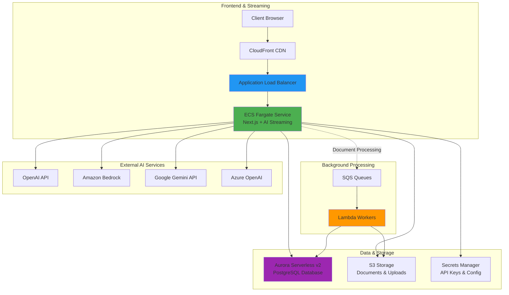

# Streaming Infrastructure Operations Guide

## Overview

This guide covers the operational aspects of the AI Studio streaming infrastructure, including ECS service management, monitoring, deployment procedures, and troubleshooting.

**Current Architecture**: Direct ECS streaming (as of PR #340, October 2025)

## Infrastructure Components

### AWS Services Stack



### Component Responsibilities

#### ECS Fargate Service
- **Purpose**: Hosts Next.js application with real-time AI streaming
- **Configuration**:
  - CPU: 0.5-2 vCPU (auto-scaling)
  - Memory: 1-4 GB (auto-scaling)
  - Tasks: 2-10 (based on load)
- **Features**:
  - HTTP/2 streaming support
  - No timeout limits
  - Auto-scaling based on CPU/memory
  - Health checks via ALB

#### Application Load Balancer
- **Purpose**: Routes HTTP traffic to ECS containers
- **Features**:
  - SSL/TLS termination
  - Health checks every 30 seconds
  - Chunked transfer encoding
  - WebSocket support (future)

#### Lambda Workers (Background Only)
- **Purpose**: Asynchronous document and data processing
- **Use Cases**:
  - Document processing (`file-processor`)
  - Textract processing (`textract-processor`)
  - URL processing (`url-processor`)
  - Embedding generation (`embedding-generator`)
- **NOT used for**: AI streaming (handled by ECS)

#### Aurora Serverless v2
- **Purpose**: PostgreSQL database for all application data
- **Access**: RDS Data API (no direct connections)
- **Auto-scaling**: 0.5-16 ACUs based on load
- **Backup**: Automated daily snapshots

## ECS Service Configuration

### Task Definition

```yaml
Family: aistudio-frontend
CPU: 512 (0.5 vCPU)
Memory: 1024 MB (1 GB)
Network Mode: awsvpc
Requires Compatibilities: FARGATE

Container:
  Name: next-app
  Image: {ACCOUNT}.dkr.ecr.{REGION}.amazonaws.com/aistudio-frontend:latest
  Port Mappings:
    - 3000:3000 (HTTP)
  Environment Variables:
    - NODE_ENV=production
    - NEXT_PUBLIC_ENVIRONMENT={env}
    - RDS_RESOURCE_ARN={arn}
    - DATABASE_SECRET_ARN={arn}
    # ... (see ENVIRONMENT_VARIABLES.md)

  Health Check:
    Command: ["CMD-SHELL", "curl -f http://localhost:3000/api/health || exit 1"]
    Interval: 30 seconds
    Timeout: 5 seconds
    Retries: 3
```

### Auto-Scaling Configuration

```yaml
Service Auto-Scaling:
  Min Capacity: 2 tasks
  Max Capacity: 10 tasks

  Target Tracking Policies:
    - Metric: ECS Service Average CPU Utilization
      Target Value: 70%
      Scale Out Cooldown: 60 seconds
      Scale In Cooldown: 300 seconds

    - Metric: ECS Service Average Memory Utilization
      Target Value: 80%
      Scale Out Cooldown: 60 seconds
      Scale In Cooldown: 300 seconds
```

## Deployment Procedures

### Standard Deployment

```bash
# 1. Build and test locally
npm install
npm run build
npm run typecheck
npm run lint

# 2. Commit changes
git add .
git commit -m "feat: description of changes"
git push origin dev

# 3. Automatic deployment via AWS Amplify
# Amplify detects changes and triggers build/deploy
```

### Manual ECS Deployment (if needed)

```bash
# 1. Build Docker image
docker build -t aistudio-frontend:latest .

# 2. Tag image
docker tag aistudio-frontend:latest \
  {ACCOUNT}.dkr.ecr.{REGION}.amazonaws.com/aistudio-frontend:latest

# 3. Push to ECR
aws ecr get-login-password --region {REGION} | \
  docker login --username AWS --password-stdin \
  {ACCOUNT}.dkr.ecr.{REGION}.amazonaws.com

docker push {ACCOUNT}.dkr.ecr.{REGION}.amazonaws.com/aistudio-frontend:latest

# 4. Deploy via CDK
cd infra
npx cdk deploy AIStudio-ECSServiceStack-Dev
```

### Rollback Procedure

```bash
# Option 1: Revert to previous task definition
aws ecs update-service \
  --cluster aistudio-dev-cluster \
  --service aistudio-dev-frontend \
  --task-definition aistudio-frontend:{PREVIOUS_REVISION}

# Option 2: Git revert and redeploy
git revert {BAD_COMMIT_HASH}
git push origin dev
# Wait for automatic deployment
```

## Monitoring and Observability

### Key Metrics to Monitor

#### ECS Service Metrics

```bash
# View ECS service metrics in CloudWatch
Namespace: AWS/ECS

Metrics:
  - CPUUtilization (should be <80%)
  - MemoryUtilization (should be <80%)
  - DesiredTaskCount
  - RunningTaskCount
  - PendingTaskCount
```

#### Application Load Balancer Metrics

```bash
Namespace: AWS/ApplicationELB

Metrics:
  - TargetResponseTime (should be <5s for most requests)
  - HealthyHostCount (should equal DesiredTaskCount)
  - UnHealthyHostCount (should be 0)
  - RequestCount
  - HTTPCode_Target_2XX_Count
  - HTTPCode_Target_5XX_Count (should be <1%)
```

#### Custom Application Metrics

```bash
# Logged via structured logging
- AI Provider API Latency
- Streaming Session Duration
- Database Query Time
- Error Rates by Endpoint
```

### CloudWatch Dashboards

Create dashboards for:
1. **ECS Service Health**
   - CPU/Memory utilization
   - Task count
   - Container instance status

2. **Application Performance**
   - Request rate
   - Response time (p50, p95, p99)
   - Error rates
   - AI provider latency

3. **Database Performance**
   - Connection count
   - Query duration
   - Read/write IOPS

### CloudWatch Alarms

```bash
# Critical Alarms
1. ECS CPU > 80% for 5 minutes
   → Trigger auto-scaling (should auto-resolve)

2. ECS Memory > 80% for 5 minutes
   → Trigger auto-scaling (should auto-resolve)

3. Unhealthy Target Count > 0 for 2 minutes
   → Page on-call engineer

4. Error Rate > 5% for 5 minutes
   → Page on-call engineer

5. ALB 5XX Errors > 10/minute for 5 minutes
   → Page on-call engineer

# Warning Alarms
1. Response Time > 10 seconds (p95)
   → Send Slack notification

2. Database Connections > 80% of max
   → Send Slack notification

3. ECS Tasks < Desired Count for 10 minutes
   → Send Slack notification
```

### Log Management

#### ECS Logs

```bash
# Stream ECS service logs
aws logs tail /aws/ecs/aistudio-dev-frontend --follow

# Filter for errors
aws logs tail /aws/ecs/aistudio-dev-frontend \
  --follow \
  --filter-pattern "ERROR"

# Filter for specific request
aws logs tail /aws/ecs/aistudio-dev-frontend \
  --follow \
  --filter-pattern "{$.requestId = \"req-123\"}"

# Get logs for specific time range
aws logs tail /aws/ecs/aistudio-dev-frontend \
  --since 1h \
  --format short
```

#### Log Retention

```yaml
Log Groups:
  - /aws/ecs/aistudio-dev-frontend
    Retention: 30 days

  - /aws/lambda/file-processor
    Retention: 14 days

  - /aws/lambda/textract-processor
    Retention: 14 days
```

## Troubleshooting Guide

### Issue: Slow Streaming Responses

**Symptoms**: AI responses take longer than expected to start streaming

**Debugging Steps**:
1. Check ECS service CPU/memory utilization
2. Check ALB target response time metrics
3. Review CloudWatch logs for AI provider API latency
4. Check database query performance

**Common Causes**:
- ECS service under-provisioned (scale up)
- AI provider API slow (check provider status)
- Database queries slow (add indexes)
- Network latency to AI providers

**Resolution**:
```bash
# Check ECS service status
aws ecs describe-services \
  --cluster aistudio-dev-cluster \
  --services aistudio-dev-frontend

# Scale up if needed
aws ecs update-service \
  --cluster aistudio-dev-cluster \
  --service aistudio-dev-frontend \
  --desired-count 5
```

### Issue: ECS Tasks Failing Health Checks

**Symptoms**: Tasks marked as unhealthy and replaced frequently

**Debugging Steps**:
1. Check CloudWatch logs for application errors
2. Review ALB target health check results
3. Check container health check command
4. Verify network connectivity

**Common Causes**:
- Application crash on startup
- Health check endpoint failing
- Insufficient memory/CPU
- Database connection failures

**Resolution**:
```bash
# View recent task failures
aws ecs list-tasks \
  --cluster aistudio-dev-cluster \
  --service-name aistudio-dev-frontend \
  --desired-status STOPPED

# Get failure reason
aws ecs describe-tasks \
  --cluster aistudio-dev-cluster \
  --tasks {TASK_ARN}
```

### Issue: High Error Rate

**Symptoms**: 500 errors, failed requests

**Debugging Steps**:
1. Check CloudWatch logs for stack traces
2. Check database connectivity
3. Review AI provider API errors
4. Check Secrets Manager access

**Common Causes**:
- Database connection pool exhausted
- AI provider API quota exceeded
- Missing environment variables
- Secrets Manager permission issues

**Resolution**:
```bash
# Check recent errors
aws logs filter-log-events \
  --log-group-name /aws/ecs/aistudio-dev-frontend \
  --filter-pattern "ERROR" \
  --start-time $(date -u -d '1 hour ago' +%s)000

# Check database connections
# Run query in Aurora to see active connections
```

### Issue: Auto-Scaling Not Working

**Symptoms**: Service not scaling despite high load

**Debugging Steps**:
1. Check auto-scaling policies
2. Review CloudWatch metrics
3. Check IAM permissions
4. Verify cooldown periods

**Resolution**:
```bash
# Verify auto-scaling target tracking
aws application-autoscaling describe-scaling-policies \
  --service-namespace ecs \
  --resource-id service/aistudio-dev-cluster/aistudio-dev-frontend

# Check current scaling activities
aws application-autoscaling describe-scaling-activities \
  --service-namespace ecs \
  --resource-id service/aistudio-dev-cluster/aistudio-dev-frontend \
  --max-results 10
```

## Backup and Disaster Recovery

### Database Backups

```yaml
Automated Backups:
  - Frequency: Daily
  - Retention: 7 days
  - Backup Window: 03:00-04:00 UTC
  - Point-in-time Recovery: Up to 7 days

Manual Snapshots:
  - Before major deployments
  - Before schema migrations
  - Retention: 30 days (manual deletion)
```

### Backup Procedures

```bash
# Create manual database snapshot
aws rds create-db-cluster-snapshot \
  --db-cluster-identifier aistudio-dev-db \
  --db-cluster-snapshot-identifier aistudio-dev-manual-$(date +%Y%m%d-%H%M%S)

# List available snapshots
aws rds describe-db-cluster-snapshots \
  --db-cluster-identifier aistudio-dev-db

# Restore from snapshot (creates new cluster)
aws rds restore-db-cluster-from-snapshot \
  --db-cluster-identifier aistudio-dev-db-restored \
  --snapshot-identifier {SNAPSHOT_ID} \
  --engine aurora-postgresql
```

### Disaster Recovery Plan

1. **RTO (Recovery Time Objective)**: 1 hour
2. **RPO (Recovery Point Objective)**: 1 hour (point-in-time recovery)

**Recovery Steps**:
```bash
# 1. Restore database from snapshot/PITR
# 2. Update CDK with restored database ARN
# 3. Deploy ECS service pointing to restored database
# 4. Verify application functionality
# 5. Update DNS if needed (ALB remains same)
```

## Security Operations

### Secret Rotation

```bash
# Rotate database credentials
aws secretsmanager rotate-secret \
  --secret-id aistudio-dev-db-secret \
  --rotation-lambda-arn {ROTATION_LAMBDA_ARN}

# Rotate AI provider API keys
# (Manual process - update in Secrets Manager, restart ECS tasks)
```

### Access Reviews

- **Frequency**: Quarterly
- **Review**: IAM roles, security groups, database access
- **Document**: Access changes in security log

### Vulnerability Scanning

```bash
# Scan Docker images
aws ecr start-image-scan \
  --repository-name aistudio-frontend \
  --image-id imageTag=latest

# View scan results
aws ecr describe-image-scan-findings \
  --repository-name aistudio-frontend \
  --image-id imageTag=latest
```

## Cost Optimization

### Current Cost Breakdown (Dev Environment)

```yaml
ECS Fargate: ~$30-40/month
  - 2-4 tasks running 24/7
  - 0.5 vCPU, 1 GB RAM per task

Application Load Balancer: ~$16/month
  - Base cost + data transfer

Aurora Serverless v2: ~$30-50/month
  - 0.5-2 ACUs based on load
  - Storage: ~10 GB

Lambda (Background Processing): ~$10-20/month
  - Document processing
  - Embedding generation

S3 Storage: ~$5-10/month
  - Documents and uploads

Total: ~$90-140/month
```

### Cost Optimization Tips

1. **Right-size ECS tasks**: Monitor CPU/memory, adjust if over-provisioned
2. **Optimize auto-scaling**: Tune thresholds to avoid over-scaling
3. **Use spot instances**: For dev/staging (50-70% cost reduction)
4. **Compress logs**: Reduce CloudWatch Logs storage costs
5. **S3 lifecycle policies**: Move old documents to Glacier

## Related Documentation

- [ECS Deployment Guide](../ECS_DEPLOYMENT.md)
- [Architecture Overview](../ARCHITECTURE.md)
- [ADR-002: Streaming Architecture Migration](../architecture/ADR-002-streaming-architecture-migration.md)
- [ADR-003: ECS Streaming Migration](../architecture/ADR-003-ecs-streaming-migration.md)
- [Environment Variables](../ENVIRONMENT_VARIABLES.md)

---

**Last Updated**: October 2025
**Migration**: PR #340 - Remove Lambda streaming workers
**Architecture**: Direct ECS streaming (no SQS polling)
