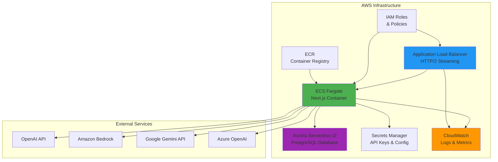

# Streaming Infrastructure Operations Guide

## Overview

This guide covers the operational aspects of the ECS-based streaming architecture, including infrastructure setup, monitoring, deployment procedures, and troubleshooting for the streaming AI system.

> **Note**: This guide reflects the current ECS direct streaming architecture (post-PR #340). For historical context on the previous Lambda polling architecture, see [archived documentation](../archive/universal-polling-architecture.md).

## Architecture Evolution

**Current (October 2025)**: ECS Fargate with HTTP/2 streaming
- All AI streaming happens directly in ECS containers
- No SQS queues or Lambda workers for streaming
- Direct HTTP/2 streaming with real-time responses

**Previous (Pre-October 2025)**: Lambda polling architecture
- SQS queue for job distribution
- Lambda workers processing streaming jobs
- Client polling for job status updates
- **Status**: Removed in PR #340 (see ADR-003)

## Infrastructure Components

### AWS Services Stack



### Key Components

#### 1. ECS Fargate Service
- **Purpose**: Host Next.js application with streaming support
- **Configuration**: Auto-scaling based on CPU/memory/request count
- **Streaming**: Native HTTP/2 support for real-time AI responses
- **Container**: Docker image from ECR repository

#### 2. Application Load Balancer (ALB)
- **Purpose**: Route HTTP traffic to ECS containers
- **Features**: Health checks, SSL termination, HTTP/2 support
- **Streaming**: Native support for chunked transfer encoding

#### 3. Aurora Serverless v2 (PostgreSQL)
- **Purpose**: Primary data store for conversations, messages, users
- **Access**: RDS Data API (serverless, no connection pooling needed)
- **Features**: Auto-scaling, automated backups, encryption at rest

#### 4. Secrets Manager
- **Purpose**: Secure storage for API keys and database credentials
- **Access**: IAM-based retrieval by ECS tasks
- **Rotation**: Automatic rotation for database credentials

## ECS Service Configuration

### Service Settings

```yaml
Service Name: aistudio-{environment}-frontend
Cluster: aistudio-{environment}-cluster
Launch Type: FARGATE
Platform Version: LATEST

Task Definition:
  CPU: 512 (0.5 vCPU)
  Memory: 1024 MB (1 GB)
  Container:
    Image: {ECR_REPOSITORY}:latest
    Port: 3000
    Protocol: HTTP

Auto Scaling:
  Min Tasks: 1
  Max Tasks: 10
  Target Metrics:
    - CPU Utilization: 70%
    - Memory Utilization: 80%
    - Request Count: 1000/minute

Health Check:
  Path: /api/health
  Interval: 30 seconds
  Timeout: 5 seconds
  Healthy Threshold: 2
  Unhealthy Threshold: 3
```

### Environment Variables

```bash
# Application Configuration
NODE_ENV=production
NEXT_PUBLIC_AWS_REGION=us-east-1

# Database Configuration
RDS_RESOURCE_ARN=arn:aws:rds:{REGION}:{ACCOUNT}:cluster:aistudio-{ENV}-db
DATABASE_SECRET_ARN=arn:aws:secretsmanager:{REGION}:{ACCOUNT}:secret:aistudio-{ENV}-db-secret

# AI Provider Configuration (from Secrets Manager)
# These are loaded dynamically via settings-manager
```

### IAM Task Role Permissions

```json
{
  "Version": "2012-10-17",
  "Statement": [
    {
      "Effect": "Allow",
      "Action": [
        "rds-data:BatchExecuteStatement",
        "rds-data:BeginTransaction",
        "rds-data:CommitTransaction",
        "rds-data:ExecuteStatement",
        "rds-data:RollbackTransaction"
      ],
      "Resource": "arn:aws:rds:{REGION}:{ACCOUNT}:cluster:aistudio-{ENV}-db"
    },
    {
      "Effect": "Allow",
      "Action": [
        "secretsmanager:GetSecretValue",
        "secretsmanager:DescribeSecret"
      ],
      "Resource": [
        "arn:aws:secretsmanager:{REGION}:{ACCOUNT}:secret:aistudio-{ENV}-db-*",
        "arn:aws:secretsmanager:{REGION}:{ACCOUNT}:secret:aistudio-{ENV}-api-keys-*"
      ]
    },
    {
      "Effect": "Allow",
      "Action": [
        "bedrock:InvokeModel",
        "bedrock:InvokeModelWithResponseStream"
      ],
      "Resource": "arn:aws:bedrock:{REGION}::foundation-model/*"
    },
    {
      "Effect": "Allow",
      "Action": [
        "s3:GetObject",
        "s3:PutObject"
      ],
      "Resource": "arn:aws:s3:::aistudio-{ENV}-uploads/*"
    },
    {
      "Effect": "Allow",
      "Action": [
        "logs:CreateLogGroup",
        "logs:CreateLogStream",
        "logs:PutLogEvents"
      ],
      "Resource": "arn:aws:logs:{REGION}:{ACCOUNT}:*"
    }
  ]
}
```

### Load Balancer Configuration

```yaml
Type: Application Load Balancer
Scheme: internet-facing
IP Address Type: IPv4

Listeners:
  - Port: 443
    Protocol: HTTPS
    SSL Policy: ELBSecurityPolicy-TLS-1-2-2017-01
    Certificate: {ACM_CERTIFICATE_ARN}
    Default Action: Forward to ECS target group

  - Port: 80
    Protocol: HTTP
    Default Action: Redirect to HTTPS

Target Group:
  Protocol: HTTP
  Port: 3000
  Target Type: IP
  Health Check Path: /api/health
  Deregistration Delay: 30 seconds
  Stickiness: Enabled (1 hour)

## Database Schema Management

### Migration Process

The AI streaming jobs table is managed through the standard migration system:

```sql
-- File: /infra/database/schema/033-ai-streaming-jobs.sql
CREATE TABLE ai_streaming_jobs (
  id UUID PRIMARY KEY DEFAULT gen_random_uuid(),
  conversation_id TEXT,                    -- Supports both integer and UUID
  user_id INTEGER NOT NULL,
  model_id INTEGER NOT NULL,
  status job_status NOT NULL DEFAULT 'pending',
  request_data JSONB NOT NULL,
  response_data JSONB,
  partial_content TEXT,
  error_message TEXT,
  created_at TIMESTAMP WITH TIME ZONE DEFAULT NOW(),
  completed_at TIMESTAMP WITH TIME ZONE
);
```

### Database Functions

```sql
-- Update job status with atomic operations
CREATE OR REPLACE FUNCTION update_job_status(
  p_job_id UUID,
  p_status job_status,
  p_partial_content TEXT DEFAULT NULL,
  p_progress_info JSONB DEFAULT NULL,
  p_error_message TEXT DEFAULT NULL
) RETURNS BOOLEAN AS $$
DECLARE
  updated_rows INTEGER;
BEGIN
  UPDATE ai_streaming_jobs 
  SET 
    status = p_status,
    partial_content = COALESCE(p_partial_content, partial_content),
    progress_info = COALESCE(p_progress_info, progress_info),
    error_message = COALESCE(p_error_message, error_message),
    started_at = CASE 
      WHEN p_status = 'running' AND started_at IS NULL 
      THEN NOW() 
      ELSE started_at 
    END,
    completed_at = CASE 
      WHEN p_status IN ('completed', 'failed') 
      THEN NOW() 
      ELSE completed_at 
    END
  WHERE id = p_job_id;
  
  GET DIAGNOSTICS updated_rows = ROW_COUNT;
  RETURN updated_rows > 0;
END;
$$ LANGUAGE plpgsql;

-- Cleanup expired jobs
CREATE OR REPLACE FUNCTION cleanup_expired_streaming_jobs()
RETURNS INTEGER AS $$
DECLARE
  deleted_count INTEGER;
BEGIN
  DELETE FROM ai_streaming_jobs 
  WHERE expires_at < NOW() 
    OR (created_at < NOW() - INTERVAL '24 hours' AND status = 'completed')
    OR (created_at < NOW() - INTERVAL '1 hour' AND status = 'failed')
    OR (created_at < NOW() - INTERVAL '2 hours' AND status = 'pending');
  
  GET DIAGNOSTICS deleted_count = ROW_COUNT;
  RETURN deleted_count;
END;
$$ LANGUAGE plpgsql;
```

### Index Optimization

```sql
-- Performance indexes for job queries
CREATE INDEX idx_ai_streaming_jobs_user_status 
ON ai_streaming_jobs(user_id, status, created_at DESC);

CREATE INDEX idx_ai_streaming_jobs_status_created 
ON ai_streaming_jobs(status, created_at) 
WHERE status IN ('pending', 'running');

CREATE INDEX idx_ai_streaming_jobs_expires 
ON ai_streaming_jobs(expires_at) 
WHERE expires_at IS NOT NULL;

CREATE INDEX idx_ai_streaming_jobs_conversation 
ON ai_streaming_jobs(conversation_id, user_id, created_at DESC);
```

## Deployment Procedures

### Infrastructure Deployment

Using AWS CDK for complete infrastructure provisioning:

```bash
# Deploy all infrastructure stacks
cd infra
npx cdk deploy --all

# Deploy specific stacks
npx cdk deploy AIStudio-DatabaseStack-{ENV}
npx cdk deploy AIStudio-FrontendStack-{ENV}  # Includes ECS service and ALB
npx cdk deploy AIStudio-StorageStack-{ENV}
```

### Application Deployment

```bash
# Build and lint the application
npm run build
npm run lint
npm run typecheck

# Build Docker container
docker build -t aistudio-frontend:latest .

# Tag and push to ECR
aws ecr get-login-password --region {REGION} | docker login --username AWS --password-stdin {ECR_REPOSITORY}
docker tag aistudio-frontend:latest {ECR_REPOSITORY}:latest
docker push {ECR_REPOSITORY}:latest

# Update ECS service (triggers rolling deployment)
aws ecs update-service \
  --cluster aistudio-{ENV}-cluster \
  --service aistudio-{ENV}-frontend \
  --force-new-deployment
```

### Database Migrations

```bash
# Run database migrations
cd infra/database
npm run migrate

# Verify migration status
npm run migrate:status
```

### Rolling Deployment Process

ECS automatically handles rolling deployments:

1. **Pull new container image** from ECR
2. **Start new tasks** with updated image
3. **Health check** new tasks via ALB
4. **Drain connections** from old tasks
5. **Terminate old tasks** once drained
6. **Complete deployment** when all tasks updated

**Monitor deployment**:
```bash
# Watch service events
aws ecs describe-services \
  --cluster aistudio-{ENV}-cluster \
  --services aistudio-{ENV}-frontend \
  | jq '.services[0].events[:5]'

# Monitor task health
aws ecs list-tasks \
  --cluster aistudio-{ENV}-cluster \
  --service-name aistudio-{ENV}-frontend
```

## Monitoring and Observability

### CloudWatch Metrics

#### Custom Metrics

```typescript
// Application metrics published to CloudWatch
const publishMetrics = async (metrics: {
  JobCreated: number;
  JobCompleted: number;
  JobFailed: number;
  ProcessingLatency: number;
  QueueDepth: number;
}) => {
  const cloudwatch = new CloudWatchClient({ region: process.env.AWS_REGION });
  
  await cloudwatch.send(new PutMetricDataCommand({
    Namespace: 'AIStudio/Streaming',
    MetricData: [
      {
        MetricName: 'JobsCreated',
        Value: metrics.JobCreated,
        Unit: 'Count',
        Timestamp: new Date()
      },
      {
        MetricName: 'ProcessingLatencyMs',
        Value: metrics.ProcessingLatency,
        Unit: 'Milliseconds',
        Dimensions: [
          { Name: 'Environment', Value: process.env.NODE_ENV }
        ]
      }
    ]
  }));
};
```

#### Dashboard Configuration

```json
{
  "widgets": [
    {
      "type": "metric",
      "properties": {
        "metrics": [
          ["AIStudio/Streaming", "JobsCreated", "Environment", "production"],
          ["AIStudio/Streaming", "JobsCompleted", "Environment", "production"],
          ["AIStudio/Streaming", "JobsFailed", "Environment", "production"]
        ],
        "period": 300,
        "stat": "Sum",
        "region": "us-east-1",
        "title": "Job Processing Metrics"
      }
    },
    {
      "type": "metric", 
      "properties": {
        "metrics": [
          ["AWS/SQS", "ApproximateNumberOfVisibleMessages", "QueueName", "aistudio-prod-streaming-jobs-queue"],
          ["AWS/SQS", "NumberOfMessagesSent", "QueueName", "aistudio-prod-streaming-jobs-queue"],
          ["AWS/SQS", "NumberOfMessagesReceived", "QueueName", "aistudio-prod-streaming-jobs-queue"]
        ],
        "period": 300,
        "stat": "Average",
        "region": "us-east-1", 
        "title": "SQS Queue Metrics"
      }
    }
  ]
}
```

### Log Aggregation

#### Structured Logging Format

```typescript
// Consistent log format across all components
interface LogEntry {
  timestamp: string;
  level: 'info' | 'warn' | 'error' | 'debug';
  message: string;
  requestId?: string;
  jobId?: string;
  userId?: string;
  provider?: string;
  modelId?: string;
  duration?: number;
  error?: {
    name: string;
    message: string;
    stack?: string;
  };
}
```

#### CloudWatch Log Groups

```yaml
Log Groups:
  - /aws/ecs/aistudio-{env}-frontend      # ECS container logs
  - /aws/ecs/containerinsights/aistudio-{env}-cluster/performance  # Container insights
  - /aws/rds/cluster/aistudio-{env}-db/slowquery  # Database slow queries
  - /aws/elasticloadbalancing/app/aistudio-{env}-alb  # ALB access logs
```

### Alerting Setup

#### CloudWatch Alarms

```typescript
// High-priority alarms for ECS-based streaming
const alarms = [
  {
    name: 'HighECSCPUUtilization',
    metric: 'AWS/ECS/CPUUtilization',
    threshold: 80,
    comparisonOperator: 'GreaterThanThreshold',
    evaluationPeriods: 3,
    period: 300,
    statistic: 'Average',
    dimensions: {
      ServiceName: 'aistudio-prod-frontend',
      ClusterName: 'aistudio-prod-cluster'
    },
    treatMissingData: 'notBreaching'
  },
  {
    name: 'HighECSMemoryUtilization',
    metric: 'AWS/ECS/MemoryUtilization',
    threshold: 85,
    comparisonOperator: 'GreaterThanThreshold',
    evaluationPeriods: 3,
    period: 300,
    statistic: 'Average',
    dimensions: {
      ServiceName: 'aistudio-prod-frontend',
      ClusterName: 'aistudio-prod-cluster'
    }
  },
  {
    name: 'UnhealthyTargets',
    metric: 'AWS/ApplicationELB/UnHealthyHostCount',
    threshold: 1,
    comparisonOperator: 'GreaterThanThreshold',
    evaluationPeriods: 2,
    period: 60,
    dimensions: {
      TargetGroup: 'aistudio-prod-frontend-tg',
      LoadBalancer: 'aistudio-prod-alb'
    }
  },
  {
    name: 'HighHTTPErrorRate',
    metric: 'AWS/ApplicationELB/HTTPCode_Target_5XX_Count',
    threshold: 10,
    comparisonOperator: 'GreaterThanThreshold',
    evaluationPeriods: 2,
    period: 300,
    statistic: 'Sum'
  },
  {
    name: 'ECSTaskCountTooLow',
    metric: 'AWS/ECS/RunningTaskCount',
    threshold: 1,
    comparisonOperator: 'LessThanThreshold',
    evaluationPeriods: 2,
    period: 60,
    dimensions: {
      ServiceName: 'aistudio-prod-frontend',
      ClusterName: 'aistudio-prod-cluster'
    }
  }
];
```

#### SNS Notification Topics

```yaml
Topics:
  - aistudio-{env}-critical-alerts
  - aistudio-{env}-operational-alerts
  
Subscriptions:
  - Protocol: email
    Endpoint: ops-team@domain.com
    Topic: aistudio-{env}-critical-alerts
  - Protocol: slack
    Endpoint: https://hooks.slack.com/...
    Topic: aistudio-{env}-operational-alerts
```

## Performance Tuning

### Database Optimization

#### Connection Pooling

```typescript
// RDS Data API with connection management
const executeSQL = async (query: string, parameters: Parameter[] = []) => {
  const rdsData = new RDSDataClient({
    region: process.env.AWS_REGION,
    maxAttempts: 3,
    retryMode: 'adaptive'
  });
  
  return await rdsData.send(new ExecuteStatementCommand({
    resourceArn: process.env.RDS_RESOURCE_ARN,
    secretArn: process.env.DATABASE_SECRET_ARN,
    database: 'aistudio',
    sql: query,
    parameters,
    includeResultMetadata: true
  }));
};
```

#### Query Optimization

```sql
-- Optimized job lookup with proper indexing
EXPLAIN (ANALYZE, BUFFERS) 
SELECT id, status, partial_content, response_data 
FROM ai_streaming_jobs 
WHERE id = $1::uuid;

-- Efficient status polling query
EXPLAIN (ANALYZE, BUFFERS)
SELECT * FROM ai_streaming_jobs 
WHERE user_id = $1 
  AND status IN ('pending', 'running') 
ORDER BY created_at DESC 
LIMIT 10;
```

### ECS Performance Optimization

#### Container Resource Tuning

```yaml
# Optimal resource allocation for streaming workloads
Task Definition:
  CPU: 512 (0.5 vCPU) - Sufficient for most AI streaming
  Memory: 1024 MB - Balances memory needs and cost

# For high-traffic environments, consider:
Task Definition (High Traffic):
  CPU: 1024 (1 vCPU)
  Memory: 2048 MB
```

#### Connection Pooling

```typescript
// Pre-initialize AWS clients for reuse across requests
import { RDSDataClient } from '@aws-sdk/client-rds-data';
import { SecretsManagerClient } from '@aws-sdk/client-secrets-manager';

// Initialize clients once at module load
const rdsClient = new RDSDataClient({
  region: process.env.AWS_REGION,
  maxAttempts: 3,
  retryMode: 'adaptive'
});

const secretsClient = new SecretsManagerClient({
  region: process.env.AWS_REGION
});

// Reuse clients across all requests
export const executeSQL = async (query: string, parameters = []) => {
  return await rdsClient.send(new ExecuteStatementCommand({
    resourceArn: process.env.RDS_RESOURCE_ARN,
    secretArn: process.env.DATABASE_SECRET_ARN,
    database: 'aistudio',
    sql: query,
    parameters
  }));
};
```

#### Auto-Scaling Configuration

```typescript
// Aggressive auto-scaling for streaming responsiveness
const scalingConfig = {
  minCapacity: 1,
  maxCapacity: 10,
  targetTrackingScaling: [
    {
      targetValue: 70,
      scaleInCooldown: 300,  // 5 minutes
      scaleOutCooldown: 60,  // 1 minute
      predefinedMetricType: 'ECSServiceAverageCPUUtilization'
    },
    {
      targetValue: 80,
      scaleInCooldown: 300,
      scaleOutCooldown: 60,
      predefinedMetricType: 'ECSServiceAverageMemoryUtilization'
    }
  ]
};
```

## Security Configuration

### API Security

#### Authentication Flow

```typescript
// JWT validation for all API endpoints
export const validateSession = async (req: Request): Promise<Session | null> => {
  const token = req.headers.authorization?.replace('Bearer ', '');
  
  if (!token) return null;
  
  try {
    const decoded = jwt.verify(token, process.env.JWT_SECRET);
    return decoded as Session;
  } catch (error) {
    return null;
  }
};
```

#### Rate Limiting

```typescript
// Implement rate limiting for job creation
const rateLimiter = new Map<string, { count: number; resetTime: number }>();

export const checkRateLimit = (userId: string): boolean => {
  const now = Date.now();
  const limit = rateLimiter.get(userId);
  
  if (!limit || now > limit.resetTime) {
    rateLimiter.set(userId, { count: 1, resetTime: now + 60000 }); // 1 minute window
    return true;
  }
  
  if (limit.count >= 10) { // 10 requests per minute
    return false;
  }
  
  limit.count++;
  return true;
};
```

### Data Protection

#### Encryption at Rest

```yaml
Database:
  Encryption: AES-256
  Key Management: AWS KMS
  Backup Encryption: Enabled

SQS:
  Encryption: Server-side encryption (SSE-SQS)
  Message Retention: 14 days

Lambda:
  Environment Variables: Encrypted with KMS
  Secrets: AWS Secrets Manager
```

#### PII Sanitization

```typescript
// Remove sensitive data from logs
export const sanitizeForLogging = (data: any): any => {
  const sensitiveFields = ['apiKey', 'password', 'token', 'email', 'phone'];
  
  if (typeof data !== 'object' || data === null) {
    return data;
  }
  
  const sanitized = { ...data };
  
  sensitiveFields.forEach(field => {
    if (field in sanitized) {
      sanitized[field] = '[REDACTED]';
    }
  });
  
  return sanitized;
};
```

## Disaster Recovery

### Backup Strategy

#### Database Backups

```yaml
Aurora Cluster Backup:
  Automatic Backups: Enabled
  Backup Retention: 30 days
  Preferred Backup Window: 03:00-04:00 UTC
  Copy Tags to Snapshots: Enabled
  
Manual Snapshots:
  Frequency: Weekly
  Retention: 1 year
  Cross-region Copy: Enabled (dr-region)
```

#### Configuration Backup

```bash
#!/bin/bash
# Backup infrastructure configuration
aws ssm put-parameter \
  --name "/aistudio/backup/infrastructure-config" \
  --value "$(cat infrastructure-config.json)" \
  --type "SecureString" \
  --overwrite

# Backup application configuration
aws s3 cp config/ s3://aistudio-backups/config/ --recursive
```

### Recovery Procedures

#### Database Recovery

```bash
# Point-in-time recovery
aws rds restore-db-cluster-to-point-in-time \
  --db-cluster-identifier aistudio-recovered \
  --source-db-cluster-identifier aistudio-prod-db \
  --restore-to-time 2024-01-15T10:30:00.000Z

# Snapshot restoration
aws rds restore-db-cluster-from-snapshot \
  --db-cluster-identifier aistudio-recovered \
  --snapshot-identifier aistudio-prod-db-snapshot-2024-01-15
```

#### Service Recovery

```bash
# Redeploy infrastructure
cd infra
npx cdk deploy --all

# Restore application from git
git checkout main
npm run build
npm run deploy

# Verify service health
curl -f https://api.aistudio.psd401.ai/health || exit 1
```

---

## Migration Notes

### October 2025: Lambda to ECS Streaming Migration

This guide has been updated to reflect the current ECS-based streaming architecture following PR #340. Key changes:

**Removed Infrastructure**:
- SQS queues for job distribution
- Lambda streaming workers
- Polling endpoints and job management
- Complex build processes for Lambda dependencies

**Current Architecture**:
- Direct ECS execution with HTTP/2 streaming
- Simplified deployment (Docker containers)
- Unified monitoring in CloudWatch
- Auto-scaling ECS tasks

**Benefits Achieved**:
- **Cost**: $40/month savings (~40% reduction)
- **Performance**: 1-5 second latency reduction, no cold starts
- **Simplicity**: Single service architecture
- **Reliability**: Fewer infrastructure components to maintain

**References**:
- [ADR-003: ECS Streaming Migration](../architecture/ADR-003-ecs-streaming-migration.md)
- [Archived: Universal Polling Architecture](../archive/universal-polling-architecture.md)
- [Updated: Assistant Architect Deployment](../ASSISTANT_ARCHITECT_DEPLOYMENT.md)

This comprehensive infrastructure guide provides the foundation for reliable, scalable, and secure operation of the ECS-based streaming architecture.

---

**Last Updated**: October 2025
**Architecture**: ECS Fargate with HTTP/2 streaming
**Previous Architecture**: Lambda polling (archived)